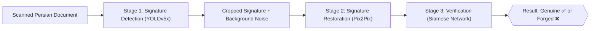

# ✍️ Persian Signature Detection Restoration and Verification
### An End-to-End System for Signature Detection, Restoration, and Verification in Persian Documents

<p align="center">
  
  
  
  
  
  
  
</p>

<p align="center">
A three-stage deep learning pipeline to <b>locate</b>, <b>restore</b>, and <b>verify the authenticity</b> of handwritten signatures on real-world Persian document images.
</p>

---

**Persian Signature Detection Restoration and Verification** is an end-to-end deep learning system for analyzing handwritten Persian signatures on scanned official documents (bank forms, administrative letters, customer letters). It combines three specialized models into a single workflow: **YOLOv5x** locates and crops signatures directly from document images, a **Pix2Pix** conditional GAN (compared against CycleGAN) restores signatures by removing stamps, dates, and overlapping handwriting to recover a clean image on a white background, and a **Siamese neural network** (with MobileNetV2 or DenseNet201 backbones) compares two signatures to determine whether they are genuine or forged. This project is based on an MSc thesis on deep learning approaches for signature detection and verification in Persian document images (see [References](#-references) for the full citation). A key contribution of the underlying research was building a **dedicated Persian official-document dataset** to address the scarcity of public data for this exact real-world scenario.

---

## 📖 Table of Contents

- [Overview](#-overview)
- [Overall Pipeline Architecture](#-overall-pipeline-architecture)
- [Repository Structure](#-repository-structure)
- [Part 1: Signature Detection - YOLOv5x](#-part-1-signature-detection---yolov5x)
- [Part 2: Signature Restoration - Pix2Pix vs. CycleGAN](#-part-2-signature-restoration---pix2pix-vs-cyclegan)
- [Part 3: Signature Verification - Siamese Network](#-part-3-signature-verification---siamese-network)
- [Datasets](#-datasets)
- [Requirements & Installation](#-requirements--installation)
- [How to Run](#-how-to-run)
- [Results Summary](#-results-summary)
- [Limitations & Notes](#-limitations--notes)
- [Future Work](#-future-work)
- [References](#-references)
- [License](#-license)

---

## 🎯 Overview

Detecting and verifying signatures in real-world official documents is far harder than working with clean, isolated signature images: signatures overlap with stamps, dates, logos, and other handwriting, and Persian signatures — being unstructured, cursive, and often free-form — add an extra layer of difficulty. To tackle this, the system is built in three sequential stages:

| Stage | Task | Model | Reported Result |
|---|---|---|---|
| 1️⃣ **Detection** | Locate the exact position of a signature within a full document image and crop it out | YOLOv5x | mAP@0.5 = **0.994**, mAP@0.5:0.95 = **0.950** (test set) |
| 2️⃣ **Restoration** | Remove stamps, dates, and overlapping text/handwriting around the detected signature, recovering a clean signature on a white background | Pix2Pix (chosen over CycleGAN) | PSNR = **38.84**, SSIM = **0.9942** (test set) |
| 3️⃣ **Verification** | Compare a query signature against a reference and classify it as genuine or forged | Siamese network (MobileNetV2 / DenseNet201 backbone + Manhattan distance) | Best accuracy = **76.13%** (DenseNet201, on clean UTSig signatures) |

---

## 🧩 Overall Pipeline Architecture



Each stage's output was evaluated independently, and the verification stage was tested on three progressively realistic versions of the same signatures: (1) clean reference signatures from UTSig, (2) signatures as extracted directly by the detector (with residual background noise), and (3) signatures after the restoration stage — confirming that restoration measurably improves downstream verification accuracy.

---

## 📂 Repository Structure

```
signature-intelligence-pipeline/
│
├── Detection_signature.ipynb          # Stage 1 - Signature localization with YOLOv5x
├── SIGNATURE_RESTORATION.ipynb        # Stage 2 - Signature restoration/cleanup with Pix2Pix & CycleGAN
├── siamese_models_sign_data.ipynb     # Stage 3 - Signature verification with a Siamese network
├── datasets/                          # Reference datasets used across all three stages (see below)
└── README.md                          # Project documentation (this file)
```

> 💡 All three notebooks are written for **Google Colab** (trained on a free-tier T4 GPU, 15 GB VRAM / 12.7 GB RAM) and can be run there directly.

> 📁 The `datasets/` folder contains the reference datasets used in this project (the custom Persian document dataset and the paired restoration dataset), made available for anyone who wants to reproduce or extend this work — please cite this repository and the original thesis if you use them.

---

## 🔎 Part 1: Signature Detection - YOLOv5x

**File:** [`Detection_signature.ipynb`](./Detection_signature.ipynb)

### Building the detection dataset
Because publicly available datasets of *real* Persian official documents are extremely limited (for privacy and anti-fraud reasons), a **custom dataset was collected from scratch**:

- **418 blank official forms/letters** were gathered and filled in by **82 volunteers** (27 men, 55 women, ages 17–60), writing as they normally would but *without* real personal information, and using colored pens for extra visual variety. The signature field was deliberately left blank on the raw forms.
  - **311** bank forms (account opening, deposit/withdrawal receipts, inter-bank payment orders, card reissue forms, etc.) collected from **9 different banks**.
  - **62** customer-satisfaction letters (sourced online).
  - **45** administrative/internal correspondence letters (sourced online).
  - All completed forms were scanned as **TIFF** files.
- To generate enough training data, these scanned documents were used as **backgrounds**, onto which real handwritten signatures from the public **UTSig** dataset were pasted at random positions, sizes, and counts (1–7 signatures per document, depending on document type/size) — e.g. bank account-opening forms typically got 4–7 signatures, while small receipts got 1–3.
- The bank-document backgrounds were reused **3 times** with different random signature placements to increase diversity, yielding a final detection dataset of **1,026 labeled images**. For every placed signature, the bounding-box coordinates (normalized center-x, center-y, width, height) were logged to a YOLO-format `.txt` label file.
- Split: **70% train (718 images) / 20% validation (205 images) / 10% test (103 images)**, split randomly.

### Model & training
- Backbone: **YOLOv5x** (chosen over the smaller `s`/`m`/`l` variants for its superior accuracy on this task, at the cost of heavier compute).
- Optimizer: **SGD**, learning rate `0.01`, batch size `16`, image size `640×640`, `350` epochs with `3` warm-up epochs, early stopping patience `100` epochs.
- Loss: combination of localization (**CIoU**) loss and objectness (binary cross-entropy) loss.
- Evaluation metric: **mAP** (mean Average Precision) at IoU 0.5 and averaged over IoU 0.5:0.95 (COCO-style), since the task is effectively single-class detection.

### Results
| Split | mAP@0.5 | mAP@0.5:0.95 |
|---|---|---|
| Train | 0.997 | 0.963 |
| Validation | 0.994 | 0.954 |
| **Test** | **0.994** | **0.950** |

The model did not miss a single signature on the test set; its only failure mode was occasionally mistaking dense handwritten text for a signature.

---

## 🎨 Part 2: Signature Restoration - Pix2Pix vs. CycleGAN

**File:** [`SIGNATURE_RESTORATION.ipynb`](./SIGNATURE_RESTORATION.ipynb)

Once a signature is detected and cropped, it is still embedded in a "dirty" background — stamps, dates, other handwriting. The goal of this stage is to translate that noisy crop into a clean signature on a plain white background.

### Building the restoration dataset
- This uses a **paired dataset**: for every detected/noisy signature crop, the corresponding *clean* version of the same signature (extracted from the pristine UTSig samples) is available as ground truth.
- Total: **8,700 images**, split into two equal domains — **4,350** noisy/background images (Domain B) and **4,350** clean images (Domain A).
- CycleGAN split: 75% train / 25% test (unsupervised, no paired validation needed).
- Pix2Pix split: 70% train / 15% validation / 15% test (supervised, requires paired images).

### Two models compared
| | CycleGAN | Pix2Pix |
|---|---|---|
| Learning paradigm | Unsupervised, unpaired image-to-image translation | Supervised, paired image-to-image translation (Conditional GAN) |
| Generator | ResNet-based, 9 residual blocks | U-Net (`unet_256`) with skip connections |
| Discriminator | Standard CNN discriminator | PatchGAN |
| Training | 200 epochs, Adam, lr `0.0002`, **batch size 1** (limited by available GPU memory) | 1000 epochs, Adam, lr `0.0002`, batch size `32`, `lambda_L1 = 100` |
| Image size | 512×512 → cropped to 256×256 | 512×512 → cropped to 256×256 |
| **PSNR** (test) | 31.46 | **38.84** |
| **SSIM** (test) | 0.984 | **0.9942** |

**Pix2Pix was selected as the final model** for the pipeline. Although CycleGAN is generally considered a stronger architecture in the literature, the available GPU memory forced training it with a batch size of just 1, which significantly hurt its performance in this experiment. Pix2Pix — helped by its paired-data supervision — achieved noticeably better quantitative and qualitative restoration results. Its main weakness appears on crops with a fully black background or text rendered in a color close to the signature's own ink color, where it still leaves some residual noise, and it can slightly reduce image resolution during restoration (which has a downstream effect on verification accuracy — see Part 3).

---

## ✅ Part 3: Signature Verification - Siamese Network

**File:** [`siamese_models_sign_data.ipynb`](./siamese_models_sign_data__1_.ipynb)

The final stage decides whether a signature is genuine or forged, using **writer-independent** verification (i.e. the model is not trained per-person; it learns a general notion of signature similarity).

### Model Architecture
- Two 224×224 input images pass through a **shared-weight backbone** (transfer learning, convolutional layers frozen).
- The two resulting embeddings are compared with the **Manhattan (L1) distance**.
- A final layer outputs a value between 0 and 1 representing the similarity/genuineness probability.
- Two backbones were evaluated: **MobileNetV2** and **DenseNet201** (both ImageNet-pretrained).

### Dataset
- **UTSig** — a public Persian signature dataset: **8,280 images from 115 signers**, each with **27 genuine signatures** and **45 forged signatures** (a combination of random forgeries — written with the opposite hand — simple forgeries, and skilled forgeries, all merged into one "forged" class for this study).
- Split: **70% train / 15% validation / 15% test**.
- The trained model was evaluated on **three versions** of the test signatures to directly measure the impact of the earlier pipeline stages:
  1. **Original UTSig** — clean reference signatures.
  2. **Post-detection** — signatures as cropped by the YOLOv5x detector (still containing background noise).
  3. **Post-restoration** — the same crops after the Pix2Pix restoration stage.

### Training configuration
```
img_size        = 224 × 224
batch_size      = 64
learning_rate   = 0.01
num_epochs      = 20
optimizer       = Adam
loss            = binary_crossentropy (Manhattan-distance similarity head)
early_stopping  = 3 epochs patience
```

### Results

**MobileNetV2 backbone**
| Test set | Accuracy | F1-score |
|---|---|---|
| Clean UTSig | 0.7088 | 0.7881 |
| Post-detection | 0.5777 | 0.5788 |
| Post-restoration | 0.6341 | 0.7009 |

**DenseNet201 backbone**
| Test set | Accuracy | F1-score |
|---|---|---|
| Clean UTSig | **0.7613** | **0.8271** |
| Post-detection | 0.6224 | 0.6798 |
| Post-restoration | 0.6465 | 0.6906 |

**Takeaways:**
- **DenseNet201 consistently outperformed MobileNetV2** across all three test conditions.
- As expected, accuracy drops sharply right after detection (noisy backgrounds confuse the verifier), but **restoration recovers a meaningful portion of that lost accuracy** for both backbones — confirming that the detection → restoration → verification pipeline is genuinely beneficial, not just an added source of error.
- The best result (DenseNet201, 76.13% accuracy on clean signatures) compares favorably to at least one recent writer-independent method evaluated on UTSig in the literature (72.7% accuracy), despite UTSig being widely reported as one of the more challenging public signature datasets due to its high proportion of skilled forgeries.

---

## 🗂️ Datasets

| Dataset | Used for | Description | Availability |
|---|---|---|---|
| **Custom Persian official-document dataset** | Detection (backgrounds) | 418 scanned bank forms / administrative letters / customer letters, filled by 82 volunteers, combined with UTSig signatures via random placement → 1,026 labeled images | Provided in [`datasets/`](./datasets) |
| **UTSig** | Detection (signature source), Restoration (clean domain), Verification | Public Persian signature dataset: 115 signers, 8,280 signatures (3,105 genuine + 5,175 forged), 600 dpi | [UTSig official page](https://academics.ut.ac.ir/en/g/nlpr-alaei) — also mirrored in [`datasets/`](./datasets) for convenience |
| **Paired restoration dataset** | Restoration (CycleGAN/Pix2Pix) | 8,700 paired images (4,350 noisy-background / 4,350 clean) derived from the detection dataset + UTSig | Provided in [`datasets/`](./datasets) |

> 📌 If you use these datasets, please reference this repository and the original thesis (see [References](#-references)).

---

## ⚙️ Requirements & Installation

Developed and tested on **Google Colab** (free tier, NVIDIA T4 GPU — 15 GB VRAM, 12.7 GB RAM).

```bash
# Detection stage (YOLOv5)
git clone https://github.com/ultralytics/yolov5.git
pip install -r yolov5/requirements.txt

# Restoration stage (Pix2Pix / CycleGAN)
git clone https://github.com/junyanz/pytorch-CycleGAN-and-pix2pix
pip install -r pytorch-CycleGAN-and-pix2pix/requirements.txt
pip install visdom dominate

# Verification stage (Siamese Network)
pip install tensorflow==2.15.1
pip install gdown pandas scikit-learn matplotlib pillow
```

### Key Libraries Used Across the Project
`TensorFlow / Keras` · `PyTorch` · `YOLOv5 (Ultralytics)` · `Pix2Pix / CycleGAN` · `scikit-learn` · `pandas` · `NumPy` · `Matplotlib` · `Pillow` · `gdown`

---

## ▶️ How to Run

1. **Clone the repository:**
   ```bash
   git clone https://github.com/<your-username>/signature-intelligence-pipeline.git
   ```
2. **Run each notebook in Google Colab**, pointing it at the corresponding data in `datasets/`:
   - `Detection_signature.ipynb` — set the dataset path to `datasets/detection/` (images + YOLO-format labels + `data.yaml`).
   - `SIGNATURE_RESTORATION.ipynb` — set the dataset path to `datasets/restoration/` (Domain A / Domain B folders for CycleGAN, or paired folders for Pix2Pix).
   - `siamese_models_sign_data__1_.ipynb` — set the dataset path to `datasets/UTSig/`.
3. **Configure parameters:** backbone choice, image size, learning rate, and epoch count are set in the `Parameters` cell of each notebook.
4. **Train and evaluate:** run the cells in order; outputs (weights, plots, metrics) are saved to Google Drive or the Colab runtime.

---

## 📊 Results Summary

| Stage | Metric | Value |
|---|---|---|
| Detection (YOLOv5x) | mAP@0.5 | 0.994 |
| Detection (YOLOv5x) | mAP@0.5:0.95 | 0.950 |
| Restoration (Pix2Pix) | PSNR | 38.84 |
| Restoration (Pix2Pix) | SSIM | 0.9942 |
| Restoration (CycleGAN, for comparison) | PSNR / SSIM | 31.46 / 0.984 |
| Verification (Siamese + DenseNet201) | Accuracy (clean) | 76.13% |
| Verification (Siamese + DenseNet201) | Accuracy (post-detection → post-restoration) | 62.24% → 64.65% |
| Verification (Siamese + MobileNetV2) | Accuracy (clean) | 70.88% |
| Verification (Siamese + MobileNetV2) | Accuracy (post-detection → post-restoration) | 57.77% → 63.41% |

---

## ⚠️ Limitations & Notes

- The notebooks were developed independently; there is currently no single script that automatically chains all three stages end-to-end — the output of one stage must currently be fed manually into the next.
- CycleGAN's weaker restoration results in this study are attributable, at least in part, to a GPU-memory-forced batch size of 1, not necessarily to the architecture itself — under more generous hardware, the CycleGAN vs. Pix2Pix comparison could change.
- Pix2Pix restoration can slightly reduce output resolution, which appears to cap some of the accuracy gains it otherwise provides to the verification stage.
- Verification accuracy (62–76%) is meaningfully lower than what's typically reported for writer-*dependent* signature verification methods, but this is expected: the model here is writer-*independent* and evaluated on UTSig, a dataset known in the literature for its unusually high proportion of skilled forgeries.
- Some file paths (especially Google Drive paths) inside the notebooks are hardcoded and should be updated to your own paths before running.

---

## 🚀 Future Work

- [ ] Chain the three stages into a single automated end-to-end pipeline (script or API) instead of three separate notebooks.
- [ ] Revisit CycleGAN with more GPU memory to allow a larger batch size and a fairer comparison against Pix2Pix.
- [ ] Expand the custom Persian document dataset with more real-world document types and noise patterns.
- [ ] Experiment with writer-*dependent* verification or contrastive/triplet-loss objectives to push verification accuracy further.
- [ ] Build a simple web demo (e.g. Flask/FastAPI + Streamlit) that runs the full detect → restore → verify pipeline on an uploaded document.

---

## 📚 References

- *"Using Deep Learning for Signature Detection and Verification in Farsi Document images"*, MSc Thesis, Shahid Bahonar University of Kerman, Faculty of Engineering, Dept. of Electrical Engineering (Telecommunication Systems), 2024.
- Ultralytics YOLOv5 — https://github.com/ultralytics/yolov5
- pytorch-CycleGAN-and-pix2pix (Jun-Yan Zhu et al.) — https://github.com/junyanz/pytorch-CycleGAN-and-pix2pix
- Isola et al., "Image-to-Image Translation with Conditional Adversarial Networks" (Pix2Pix, CVPR 2017)
- Zhu et al., "Unpaired Image-to-Image Translation using Cycle-Consistent Adversarial Networks" (CycleGAN, ICCV 2017)
- Koch et al., "Siamese Neural Networks for One-shot Image Recognition" (2015)
- UTSig: Persian Offline Signature Dataset — University of Tehran

---

## 📄 License

This project is licensed under the **MIT License** — see the [LICENSE](./LICENSE) file for details.

If you use the datasets in `datasets/`, or any of the third-party repositories mentioned in the References section, please cite this repository and the original thesis, and review each third-party tool's own license separately.

<p align="center">
Built with ❤️ to advance research in Persian document image processing and signature forgery detection
</p>
