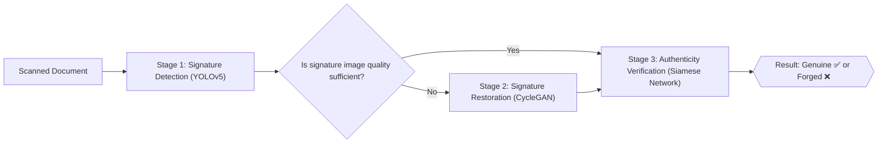

# ✍️ Signature Intelligence Pipeline
### An End-to-End System for Signature Detection, Restoration, and Verification

<p align="center">
  
  
  
  
  
  
  
</p>

<p align="center">
A three-stage deep learning pipeline to <b>locate</b>, <b>restore</b>, and <b>verify the authenticity</b> of handwritten signatures on scanned documents.
</p>

---

**Signature Intelligence Pipeline** is an end-to-end deep learning system for analyzing handwritten signatures on scanned documents. It combines three specialized models into a single workflow: **YOLOv5** locates and crops signatures directly from document images, **CycleGAN** restores low-quality, faded, or noisy signatures into clean, usable images, and a **Siamese neural network** (with interchangeable backbones such as MobileNetV2, ResNet50, and Xception) compares two signatures to determine whether they are genuine or forged. Built and trained on Google Colab using the Tobacco-800 and ICDAR 2011 datasets, this project demonstrates a practical, modular approach to automated signature detection, restoration, and forgery verification — useful for banking, legal, and administrative document processing pipelines.

---

## 📖 Table of Contents

- [Overview](#-overview)
- [Overall Pipeline Architecture](#-overall-pipeline-architecture)
- [Repository Structure](#-repository-structure)
- [Part 1: Signature Detection - YOLOv5](#-part-1-signature-detection---yolov5)
- [Part 2: Signature Restoration - CycleGAN](#-part-2-signature-restoration---cyclegan)
- [Part 3: Signature Verification - Siamese Network](#-part-3-signature-verification---siamese-network)
- [Datasets Used](#-datasets-used)
- [Requirements & Installation](#-requirements--installation)
- [How to Run](#-how-to-run)
- [Results](#-results)
- [Limitations & Notes](#-limitations--notes)
- [Future Work](#-future-work)
- [References](#-references)
- [License](#-license)

---

## 🎯 Overview

This project implements an end-to-end deep learning system for processing handwritten signatures on scanned documents (e.g. banking, legal, and administrative paperwork). The goal is to build a chain of three deep learning models, each handling one stage of signature analysis:

| Stage | Task | Model / Method | Output |
|---|---|---|---|
| 1️⃣ **Detection** | Locate the exact position of a signature within a document image | YOLOv5 | Bounding box around the signature |
| 2️⃣ **Restoration** | Denoise and reconstruct low-quality, faded, or noisy-background signatures | CycleGAN (pix2pix framework) | Clean, reconstructed signature image |
| 3️⃣ **Verification** | Compare two signatures and determine whether they are Genuine or Forged | Siamese network with pretrained backbones | Genuine / Forged label + similarity score |

These three stages can be used independently or combined into a full pipeline: a signature is first extracted from a document, restored if its quality is poor, and finally compared against a reference sample.

---

## 🧩 Overall Pipeline Architecture



---

## 📂 Repository Structure

```
signature-intelligence-pipeline/
│
├── Detection_signature.ipynb          # Stage 1 - Signature localization with YOLOv5
├── SIGNATURE_RESTORATION.ipynb        # Stage 2 - Signature restoration/cleanup with CycleGAN
├── siamese_models_sign_data.ipynb     # Stage 3 - Signature authenticity verification with a Siamese network
└── README.md                          # Project documentation (this file)
```

> 💡 All three files are written as **Google Colab** notebooks and can be run directly on Colab.

---

## 🔎 Part 1: Signature Detection - YOLOv5

**File:** [`Detection_signature.ipynb`](./Detection_signature.ipynb)

This stage uses a **YOLOv5x** architecture to detect the location of signatures (and logos) within document images.

### Key Features
- Built on top of the official [`ultralytics/yolov5`](https://github.com/ultralytics/yolov5) framework.
- Adapted from ideas and structure in the [`Signature-Verification_System_using_YOLOv5-and-CycleGAN`](https://github.com/amaljoseph/Signature-Verification_System_using_YOLOv5-and-CycleGAN) project.
- Trained on the **Tobacco-800** dataset in YOLO format (images + labels).
- Two defined classes: `DLForgery` and `DLGeniune` (forged / genuine signature detected in the document).
- Training configuration: `--img 640 --batch 16 --epochs 350 --single-cls`
- Inference capabilities: saving results as text (`--save-txt`), CSV (`--save-csv`), cropped signature images (`--save-crop`), and model attention visualizations (`--visualize`).

### Workflow
1. Mount Google Drive to access the dataset and checkpoints.
2. Clone the reference repositories (YOLOv5 and the base project).
3. Configure the dataset config file (`tobacco_data.yaml`) and number of classes.
4. Train the model (with the ability to resume from the last checkpoint).
5. Run inference on new images and save the outputs (bounding boxes, labels, cropped images).

---

## 🎨 Part 2: Signature Restoration - CycleGAN

**File:** [`SIGNATURE_RESTORATION.ipynb`](./SIGNATURE_RESTORATION.ipynb)

The goal of this stage is to restore low-quality, faded, or noisy-background signatures into clean images that can be reliably used in the verification stage.

### Key Features
- Built on the well-known [`pytorch-CycleGAN-and-pix2pix`](https://github.com/junyanz/pytorch-CycleGAN-and-pix2pix) framework by Jun-Yan Zhu et al.
- Model: `CycleGAN`, based on *unpaired image-to-image translation* — meaning exact pairs (degraded image / clean image) of the same signature are not required.
- Custom dataset: `sign_dataset_for_restoration_cyclegan`, containing two image domains:
  - `Domain A`: raw/noisy/low-quality signatures
  - `Domain B`: clean, high-quality signatures
- Training with checkpoint resuming (`--continue_train --epoch_count ...`) for better management of Colab resources.
- Model testing using the reverse generator (`latest_net_G_B.pth`) to translate from domain B back to domain A and vice versa.
- Ability to monitor training progress with `visdom`.

### Workflow
1. Mount Google Drive and download the restoration dataset.
2. Install CycleGAN dependencies (`visdom`, `dominate`, ...).
3. Train the `cycle_gan` model on the signature dataset.
4. Test the model on the `testB` set and generate restored images.

> ⚠️ **Note:** The `ssh`/`visdom server` sections in this notebook are only used for graphical monitoring of training on Colab and are not required to run the core pipeline (they can be removed).

---

## ✅ Part 3: Signature Verification - Siamese Network

**File:** [`siamese_models_sign_data.ipynb`](./siamese_models_sign_data__1_.ipynb)

The core of the system for determining whether a signature is genuine or forged, by pairwise comparison of signature images through a **Siamese network**.

### Model Architecture
- Two input images (a reference signature and the signature under review) are fed simultaneously into a **shared-weight backbone**.
- The resulting embedding vectors are compared using the **Manhattan distance (L1)** metric.
- A final `Dense` layer with `sigmoid` activation produces the binary classification output (genuine / forged).

### Selectable Backbones
For greater flexibility, the model supports any of the following backbones (with ImageNet-pretrained weights):

| Backbone | Type |
|---|---|
| `custom_cnn` | Lightweight custom convolutional network |
| `Xception` | Pretrained (ImageNet) |
| `InceptionV3` | Pretrained (ImageNet) |
| `ResNet50` | Pretrained (ImageNet) |
| `MobileNetV2` | Pretrained (ImageNet) ✅ (default backbone in the notebook) |
| `DenseNet121` | Pretrained (ImageNet) |

With `freeze_conv_layers=True`, the backbone's convolutional layers can be frozen, fine-tuning only the top layers (transfer learning).

### Dataset & Preprocessing
- Dataset: [ICDAR 2011 Signature Dataset](https://www.kaggle.com/datasets/robinreni/signature-verification-dataset) from Kaggle, combined with restored images (output of the CycleGAN stage) as supplementary data.
- A custom `DataLoader` for loading image pairs (`Image1`, `Image2`) along with a similarity label (`Label`).
- Image normalization by subtracting the mean and dividing by the standard deviation (`img_norm`).
- Data split into `train` / `validation` (17.7%) / `test`.

### Training Configuration
```python
img_size        = 224
batch_size      = 64
learning_rate   = 1e-2   # with ExponentialDecay schedule
num_epoches     = 20
steps_per_epoch = 100
optimizer       = Adam (with weight_decay=0.2)
loss            = binary_crossentropy
metrics         = accuracy, F1-score (custom implementation)
callbacks       = EarlyStopping, ModelCheckpoint (based on val_accuracy)
```

### Evaluation
- Normalized confusion matrix.
- Full classification report (`classification_report`) including precision, recall, and F1-score.

---

## 🗂️ Datasets Used

| Dataset | Purpose | Source |
|---|---|---|
| **Tobacco-800** (YOLO format) | Training the signature detection model | [amaljoseph/Signature-Verification_System_using_YOLOv5-and-CycleGAN](https://github.com/amaljoseph/Signature-Verification_System_using_YOLOv5-and-CycleGAN) repository |
| **sign_dataset_for_restoration_cyclegan** | Training the signature restoration model | Private Google Drive (project-specific) |
| **ICDAR 2011 Signature Dataset** | Training and testing the verification model | [Kaggle - robinreni/signature-verification-dataset](https://www.kaggle.com/datasets/robinreni/signature-verification-dataset) |

> 📌 Private datasets (such as the restoration dataset) are not included in this repository and must be downloaded from Google Drive using the links inside the notebooks.

---

## ⚙️ Requirements & Installation

This project is designed to run on **Google Colab** (to take advantage of free GPU access and easy Google Drive integration), but it can also run in a local environment with minor path adjustments.

### Core Requirements
```bash
# Detection stage (YOLOv5)
git clone https://github.com/ultralytics/yolov5.git
pip install -r yolov5/requirements.txt

# Restoration stage (CycleGAN)
git clone https://github.com/junyanz/pytorch-CycleGAN-and-pix2pix
pip install -r pytorch-CycleGAN-and-pix2pix/requirements.txt
pip install visdom dominate

# Verification stage (Siamese Network)
pip install tensorflow==2.15.1
pip install kaggle gdown pandas scikit-learn matplotlib pillow
```

### Key Libraries Used Across the Project
`TensorFlow / Keras` · `PyTorch` · `YOLOv5 (Ultralytics)` · `CycleGAN / pix2pix` · `scikit-learn` · `pandas` · `NumPy` · `Matplotlib` · `Pillow` · `gdown` · `Kaggle API`

---

## ▶️ How to Run

1. **Clone the repository:**
   ```bash
   git clone https://github.com/<your-username>/signature-intelligence-pipeline.git
   ```
2. **Run each notebook in Google Colab:**
   - Open `Detection_signature.ipynb`, connect to Google Drive, and set your Tobacco-800 dataset path in `tobacco_data.yaml`.
   - Open `SIGNATURE_RESTORATION.ipynb` and load the restoration dataset (containing `trainA`/`trainB` folders) from Drive.
   - Open `siamese_models_sign_data__1_.ipynb`, upload your Kaggle API key (`kaggle.json`), and download the ICDAR 2011 dataset.
3. **Configure parameters:** Adjust the backbone, image size, learning rate, and number of epochs in the `Parameters` cell of each notebook as needed.
4. **Train and evaluate:** Run the cells in order; model outputs (weights, plots, and reports) are saved to Google Drive or the Colab environment.

---

## 📊 Results

Sample results obtained while training the Siamese model (backbone: `MobileNetV2`) on the ICDAR 2011 dataset:

| Metric (validation set, first to last epoch) | Value |
|---|---|
| Best validation accuracy | Above 90% in mid-range epochs |
| Validation F1-score | Steady growth up to around 0.9 in final epochs |
| Final classification report (test set) | Precision / Recall / F1 close to 1.00 on test samples |

> 📈 Full accuracy, loss, and F1-score curves for each epoch can be found in the cell outputs of the `siamese_models_sign_data__1_.ipynb` notebook.

---

## ⚠️ Limitations & Notes

- The notebooks were developed independently, and there is currently no single script that automatically connects all three stages into a true end-to-end pipeline; the output of each stage must be manually fed into the next.
- Some file paths (especially Google Drive paths) are hardcoded as absolute paths and must be replaced with your own paths before running.
- The `visdom`/`ssh` monitoring section in the restoration notebook is purely for visualizing training progress and is optional.
- The very high reported performance (close to 100%) in some Siamese model evaluations may result from train/test overlap or a small test set size; re-evaluation on fully independent data is recommended before real-world use.

---

## 🚀 Future Work

- [ ] Integrate the three models into a single unified pipeline (script or API) instead of three separate notebooks.
- [ ] Build a web application/service (e.g. with Flask/FastAPI + Streamlit) to upload a document and view the detected signature, its restored version, and the final verification result.
- [ ] Improve the restoration dataset with more real-world samples (noise, stains, strikethroughs).
- [ ] Experiment with more modern verification architectures such as Triplet Loss or Contrastive Learning.
- [ ] Perform full cross-dataset evaluation to properly measure the real-world generalization of the models.

---

## 📚 References

- Ultralytics YOLOv5 — https://github.com/ultralytics/yolov5
- Signature Verification System using YOLOv5 and CycleGAN — https://github.com/amaljoseph/Signature-Verification_System_using_YOLOv5-and-CycleGAN
- pytorch-CycleGAN-and-pix2pix (Jun-Yan Zhu et al.) — https://github.com/junyanz/pytorch-CycleGAN-and-pix2pix
- ICDAR 2011 Signature Verification Dataset (Kaggle) — https://www.kaggle.com/datasets/robinreni/signature-verification-dataset
- Siamese Neural Networks for One-shot Image Recognition (Koch et al., 2015)
- Zhu et al., "Unpaired Image-to-Image Translation using Cycle-Consistent Adversarial Networks" (CycleGAN, ICCV 2017)

---

## 📄 License

This project was developed strictly for **educational and research purposes**. If you use any of the third-party repositories or datasets mentioned in the References section, please review each one's license and terms of use separately.

<p align="center">
Built with ❤️ to advance research in document image processing and signature forgery detection
</p>
